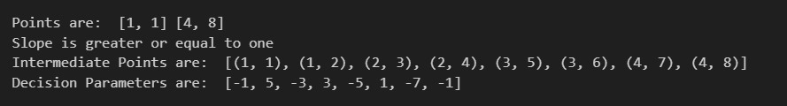

# Assignment on Computer Graphics
## Topic: Implementation of Bresenham's Line Algorithm Using Python

This script exemplifies **Bresenham's Line Algorithm** for line rendering in computer graphics, renowned for its precision in drawing lines on raster-based displays. It leverages integer-based calculations and decision-making logic, providing a pixel-perfect representation of lines.

**Highlights:**

- Modular code structure with distinct routines for handling various line orientations.
- Utilization of `matplotlib` for graphical illustration, enhancing comprehension.
- Supports rendering lines of both shallow and steep gradients.
- Embedded examples for immediate demonstration of capabilities.

## Demonstrations
The following instances were employed to validate the algorithm's effectiveness:

- **Comprehensive Visualization**: 

- **Example 1**: Drawing a line from (1,1) to (8,4) - Demonstrates handling of a mild slope, where 0 < m < 1.
.png)

- **Example 2**: Drawing a line from (1,1) to (4,8) - Illustrates processing of a steep slope, where m > 1.
.png)

## Handling Steep Slopes (m > 1)

To adeptly manage lines with slopes surpassing 1, the algorithm introduces the following adjustments:

- **Coordinate Interchange:** It exchanges the roles of X and Y coordinates for the endpoints. This maneuver essentially recalibrates steep inclines into gentle ones by inverting the slope to its reciprocal (1/m).
- **Decision Parameter Alteration:** For an optimal decision parameter (`p`), the formula is modified to `p_new = 2 * dx - dy`, reflecting the coordinate swap and slope inversion. For standard scenarios, the decision parameter (`p`) is refined as `p_new = p + 2 * dx - 2 * dy`.

These refinements guarantee the precise enumeration of intermediary points across all inclinations, preserving the algorithm's inherent accuracy and simplicity.

## Written By : Md Sadman Hafiz , Dept. Of Software Engineering, IICT, SUST

## Reg No : 2018831057

